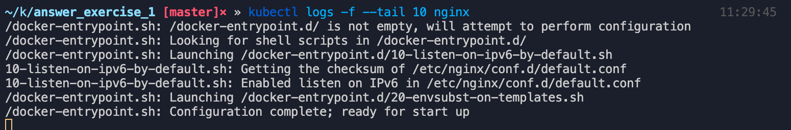
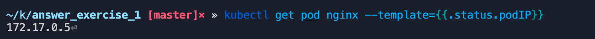
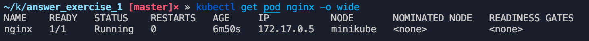
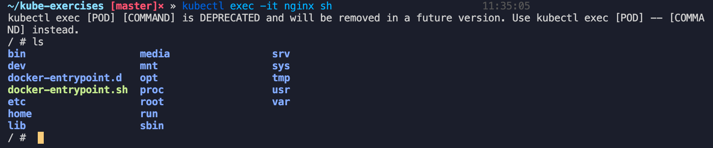
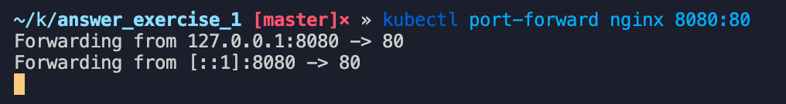
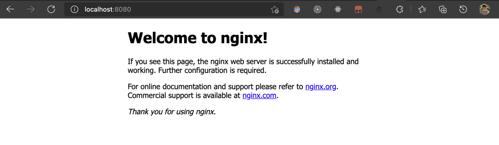
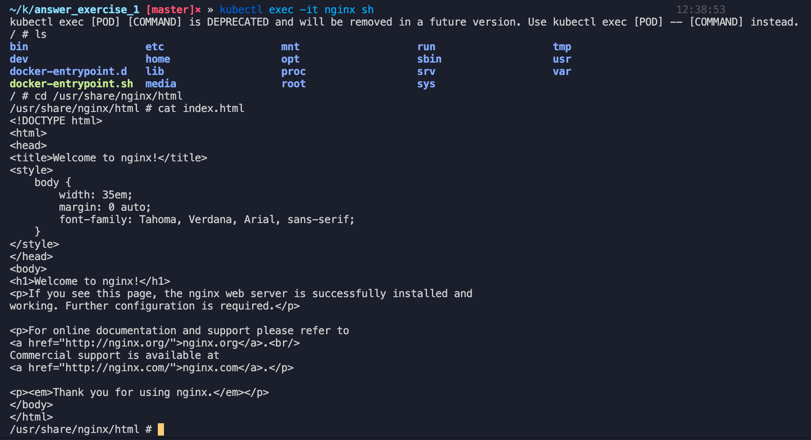
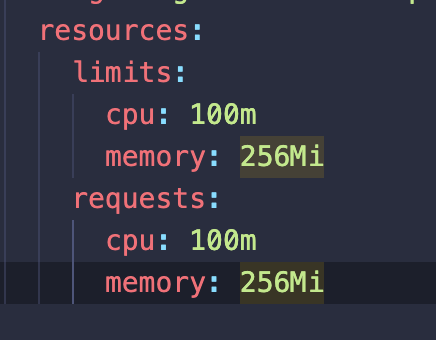
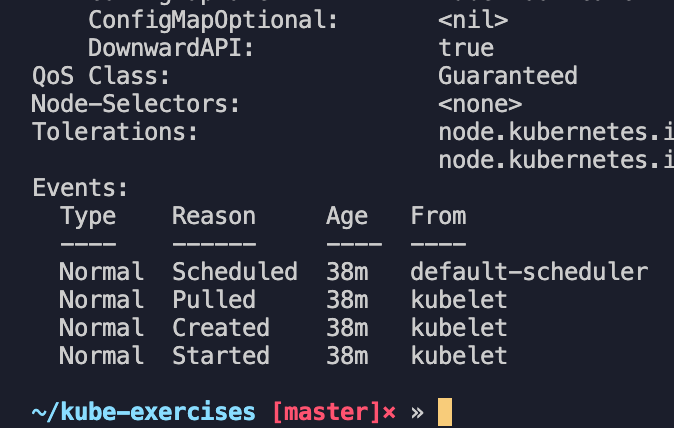

## Crea un pod de forma declarativa con las siguientes especificaciones:

- Imagen: nginx
- Version: 1.19.4
- Label: app: nginx-server
- Limits: CPU: 100 milicores, Memoria: 256Mi
- Requests: CPU: 100 milicores, Memoria: 256Mi

### ¿Cómo puedo obtener las últimas 10 líneas de la salida estándar (logs generados por la aplicación)?

```jsx
kubectl logs -f --tail 10 nginx
```



### ¿Cómo podría obtener la IP interna del pod? Aporta capturas para indicar el proceso que seguirías.

De dos formas:

```jsx
kubectl get pod nginx --template={{.status.podIP}}
```



```jsx
kubectl get pod nginx -o wide
```



### ¿Qué comando utilizarías para entrar dentro del pod?

```jsx
kubectl exec -it nginx sh
```



### Necesitas visualizar el contenido que expone NGINX, ¿qué acciones debes llevar a cabo?

Hay dos formas:

- Realizando un port forwarding , el primer puerto es nuestro local y el segundo es el puerto que el pod está escuchando.

```jsx
kubectl port-forward nginx 8080:80
```





- Accediendo directamente al contenedor y ver el index.html por defecto mediante un cat index.html.



### Indica la calidad de servicio (QoS) establecida en el pod que acabas de crear. ¿Qué lo has mirado?

El QoS es Guaranteed ya que los resources limit y requests son iguales.



Revisando el describe podemos encontrarlo igualmente al final.

```jsx
kubectl describe pod nginx
```


