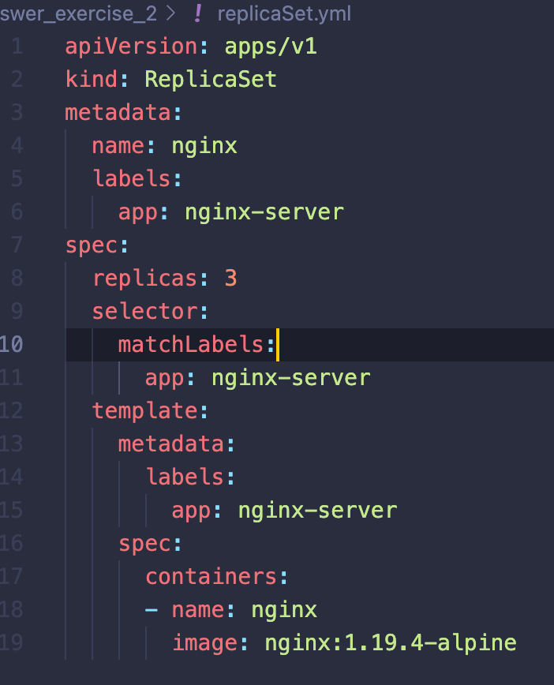
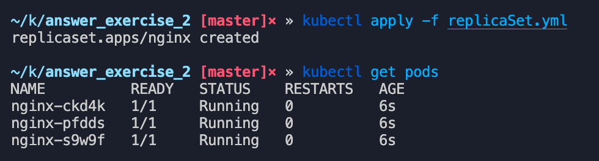
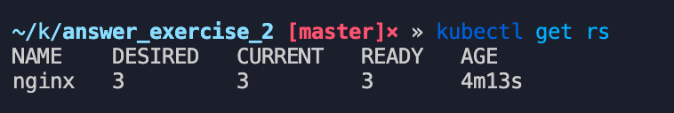
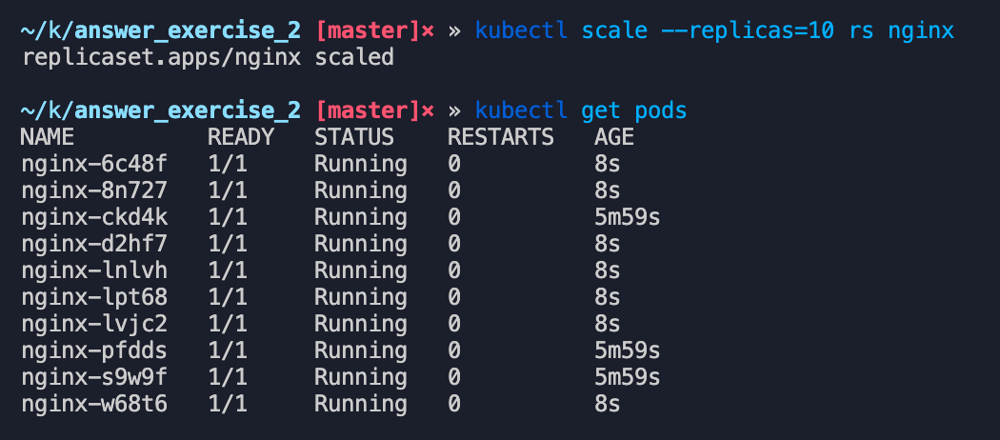

## Crear un objeto de tipo replicaSet a partir del objeto anterior con las siguientes especificaciones:

### Debe tener 3 replicas







## ¿Cúal sería el comando que utilizarías para escalar el número de replicas a 10?

```jsx
kubectl scale --replicas=10 rs nginx
```



## Si necesito tener una replica en cada uno de los nodos de Kubernetes, ¿qué objeto se adaptaría mejor?

El objeto DaemonSet ya que garantiza que todos los nodos del clúster ejecuten una copia del pod.
