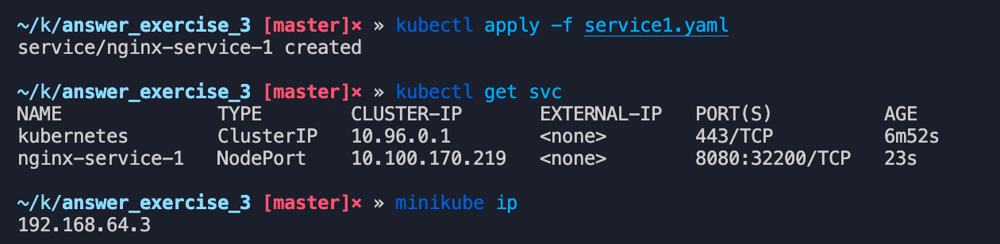
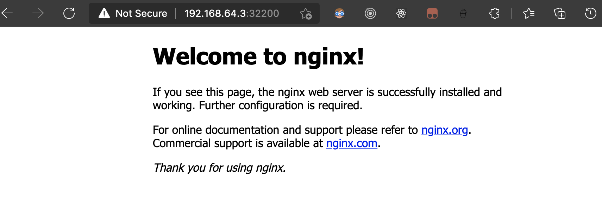
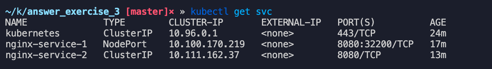
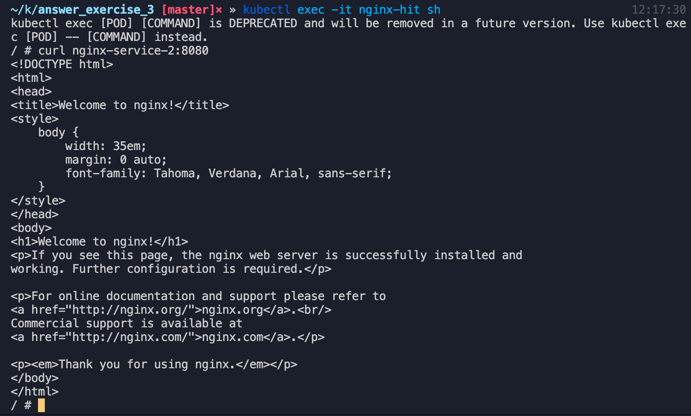
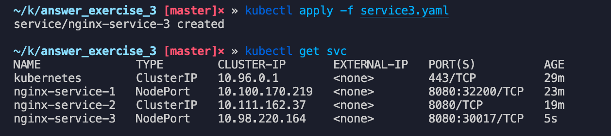
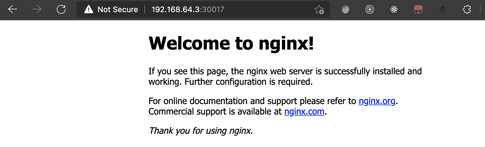

## Crea un objeto de tipo service para exponer la aplicación del ejercicio anterior de las siguientes formas:

### Exponiendo el servicio hacia el exterior (crea service1.yaml)

```jsx
kubectl apply -f service1.yaml
```



Ingresamos con el puerto dinámico que se nos asignó: 32200



### De forma interna, sin acceso desde el exterior (crea service2.yaml)

```jsx
kubectl apply -f service2.yaml
```



Para comprobar he creado un pod(nginx-hit ) por separado para golpear a ese servicio mediante un curl hacia nginx-service-2:8080 y vemos que devuelve el html.



### Abriendo un puerto específico de la VM (crea service3.yaml)



Si accedemos con la ip del minikube y el puerto fijo que asignamos en la vm, obtenemos el html:


