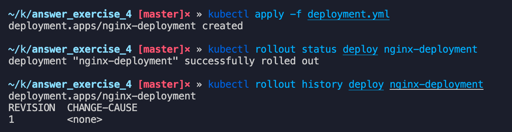

## Crear un objeto de tipo deployment con las especificaciones del ejercicio 1.

### Despliega una nueva versión de tu nuevo servicio mediante la técnica “recreate”

### Despliega una nueva versión haciendo “rollout deployment”

Modificamos directamente el archivo la imagen de nginx:1.19.2-alpine hacia nginx:1.19.4-alpine y volvemos a lanzar el deployment :

Hacemos un describe y observamos que estamos en la versión nginx:1.19.4-alpine

### Realiza un rollback a la versión generada previamente (revision 1)

Estamos de nuevo en la imagen nginx:1.19.2-alpine

