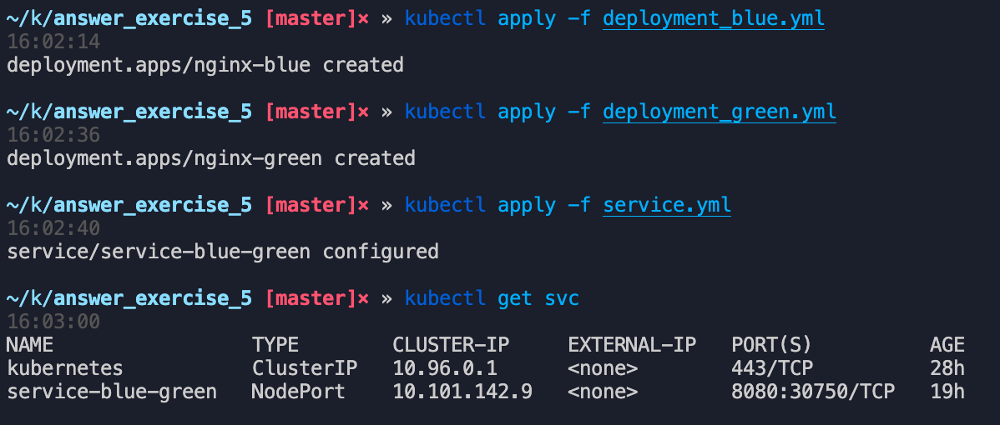
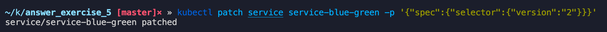
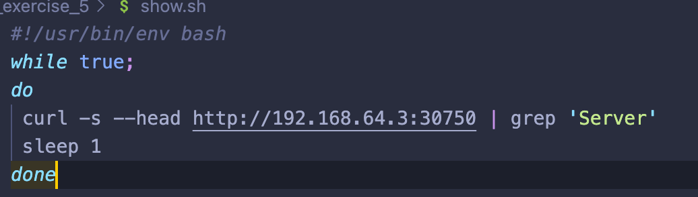
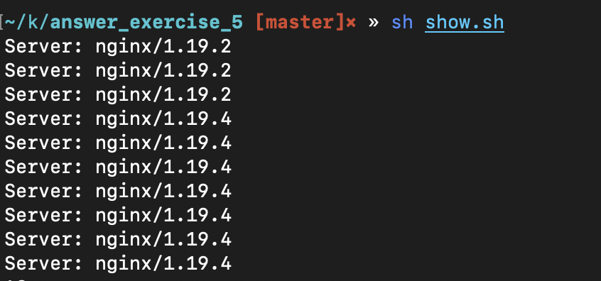

## Diseña una estrategia de despliegue que se base en ”Blue Green”. Podéis utilizar la imagen del ejercicio 1.

Imaginemos dos deployments:

- Deployment blue(v1, nginx:1.19.2-alpine) actualmente en producción junto con su servicio.

- Deployment green(v2, nginx:1.19.4-alpine) en la cual se hará pruebas.



Se acabó la validación y se ordena cambiar el tráfico de la versión 1 a 2 , lo hacemos cambiando el selector del servicio corriendo en producción con el comando:

```jsx
kubectl patch service service-blue-green -p '{"spec":{"selector":{"version":"2"}}}'
```



Realizando un bucle de curls podemos observar como cambia el tráfico en el header Server de la img de ngnix:



Una vez asegurado que todo bien podemos eliminar el deployment blue :

